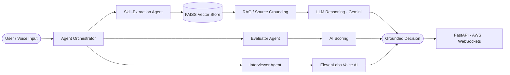

<!-- ╔══════════════════════════════════════════════════════════════════════╗ -->
<!-- ║                      SHRIANSH VIKRAM SINGH                            ║ -->
<!-- ║              AI Systems Engineer · Multi-Agent Architect             ║ -->
<!-- ╚══════════════════════════════════════════════════════════════════════╝ -->

<div align="center">

<!-- ══════════════════════ HERO BANNER ══════════════════════ -->


<!-- ══════════════════════ TYPING SVG ══════════════════════ -->

<a href="https://github.com/shriansh">

</a>

<!-- ══════════════════════ TOP BADGES ══════════════════════ -->

<p>


</p>

<p>
<a href="https://www.linkedin.com/in/shriansh"></a>
<a href="mailto:shriansh@example.com"></a>
<a href="https://github.com/shriansh"></a>
<a href="https://twitter.com/shriansh"></a>
</p>

</div>


<!-- ══════════════════════ INTRODUCTION ══════════════════════ -->

## `>` whoami

```python
class ShrianshVikramSingh:
    def __init__(self):
        self.role          = "AI Systems Engineer"
        self.specialties   = ["Multi-Agent Systems", "Voice AI", "RAG", "LLM Infra"]
        self.shipped       = "6 production AI Interview Agents on ElevenLabs Voice AI"
        self.research      = "AI-based Fall Detection in IoT @ IBIoT Lab, MMMUT"
        self.recognition   = ["2nd / 1100+ teams @ IISc ArtPark", "Top 5 / 1500+ @ Zynd AIckathon"]
        self.stack         = ["LangChain", "FastAPI", "FAISS", "Gemini", "AWS", "Flutter"]
        self.mindset       = "Architect systems. Automate workflows. Ship to prod."

    def current_focus(self):
        return "Autonomous agent orchestration + retrieval-grounded reasoning"
```

> **AI Engineer with production experience** designing LLM-powered multi-agent systems, autonomous agents, voice-automated hiring pipelines, and retrieval-augmented architectures. I architect cloud-native generative AI products end-to-end — from agent orchestration to vector retrieval to deployment. National-level AI hackathon winner, applied AI researcher, and open-source contributor who operates beyond the student level.


<!-- ══════════════════════ FOCUS AREAS ══════════════════════ -->

## `>` AI Engineering Focus Areas

<div align="center">

| 🧠 Multi-Agent Systems | 🔍 Retrieval-Augmented Generation | 🎙️ Voice AI |
|:---:|:---:|:---:|
| Autonomous agent orchestration, tool-use, and decentralized AI swarms | Source-grounded responses, vector search, hallucination reduction | Conversational intelligence, adaptive questioning, real-time STT |

| ⚡ LLM Infrastructure | ☁️ Cloud-Native AI | 🔬 Applied Research |
|:---:|:---:|:---:|
| Prompt/agent pipelines, async backends, scalable inference | AWS-deployed AI apps, microservices, real-time monitoring | ML pipelines, real-time detection, IoT analytics |

</div>


<!-- ══════════════════════ TECH STACK ══════════════════════ -->

## `>` Tech Stack

**AI / ML & Agents**


**Voice AI**


**Backend & APIs**


**Cloud & Infra**


**Frontend & Mobile**


**Databases**


<!-- ══════════════════════ FEATURED PROJECTS ══════════════════════ -->

## `>` Featured Projects

<table>
<tr>
<td width="50%" valign="top">

### 🧬 SynapSoul Nexus
**Source-Grounded AI Research Platform**

> **Problem** — Research synthesis is slow, and LLMs hallucinate when reasoning over large corpora.
>
> **Architecture** — FastAPI service orchestrating LangChain retrieval chains over a FAISS vector index, with Gemini as the reasoning engine and a RAG layer enforcing source grounding.
>
> **Stack** — `FastAPI` · `LangChain` · `Gemini` · `FAISS` · `RAG` · `Python`
>
> **Impact** — Generates executive summaries with citations; measurably reduces hallucination via retrieval grounding.
>
> **Innovation** — Automated research pipeline with traceable, source-attributed reasoning.

</td>
<td width="50%" valign="top">

### 🎵 Sargam
**AI-Native Music Platform**

> **Problem** — Music discovery ignores real-time emotional context.
>
> **Architecture** — Flutter client backed by Supabase, with a Gemini-powered Emotion Engine driving an AI DJ, setlist builder, and dynamic playlist generation.
>
> **Stack** — `Flutter` · `Gemini` · `Supabase`
>
> **Impact** — Personalized, emotion-aware listening experiences generated on the fly.
>
> **Innovation** — Emotion → music mapping engine with autonomous AI DJ curation.

</td>
</tr>
<tr>
<td width="50%" valign="top">

### 🛡️ SwiftShield
**AI-Powered Micro-Insurance Platform**

> **Problem** — Micro-insurance lacks real-time risk pricing and fast, fraud-resistant claims.
>
> **Architecture** — FastAPI backend serving an XGBoost predictive risk engine, with WebSocket channels for real-time monitoring and automated claim processing.
>
> **Stack** — `FastAPI` · `XGBoost` · `WebSockets`
>
> **Impact** — Real-time risk scoring, automated claims, and fraud detection in one pipeline.
>
> **Innovation** — Live predictive risk engine fused with streaming fraud detection.

</td>
<td width="50%" valign="top">

### 🚑 Zynd Alpha
**Decentralized Multi-Agent AI Swarm** · *Top 5 / 1500+*

> **Problem** — Emergency medical dispatch is centralized, slow, and identity-fragile.
>
> **Architecture** — A decentralized multi-agent AI swarm coordinating LLM reasoning, voice intake, and image analysis, with Twilio comms and Polygon ID for verifiable identity.
>
> **Stack** — `LLMs` · `Voice AI` · `Image Analysis` · `Flutter` · `Twilio` · `Polygon ID`
>
> **Impact** — Autonomous emergency dispatch coordination across distributed agents.
>
> **Innovation** — Decentralized agent swarm for life-critical, real-time coordination.

</td>
</tr>
<tr>
<td width="50%" valign="top">

### 🤖 Multi-Agent AI Interview System
**Voice-Automated Hiring Pipeline** · *Production @ Procand*

> **Problem** — First-round screening is manual, slow, and inconsistent.
>
> **Architecture** — 6 specialized AI interview agents built on ElevenLabs Voice AI, performing adaptive questioning, skill extraction, candidate evaluation, and AI scoring across an automated pipeline.
>
> **Stack** — `ElevenLabs` · `Conversational AI` · `LLMs` · `Python`
>
> **Impact** — Eliminated recruiter involvement in first-round screening.
>
> **Innovation** — Multi-agent voice interviewers with adaptive, evaluative reasoning.

</td>
<td width="50%" valign="top">

### 🩺 AI Fall Detection
**Smart-Healthcare Research** · *IBIoT Lab, MMMUT*

> **Problem** — Fall events in elderly/at-risk populations go undetected in real time.
>
> **Architecture** — ML pipelines over IoT sensor streams performing real-time detection and analytics for smart-healthcare environments.
>
> **Stack** — `Machine Learning` · `IoT Analytics` · `Real-Time Systems`
>
> **Impact** — Real-time fall detection for safer assisted-living environments.
>
> **Innovation** — Sensor-fusion ML pipeline tuned for low-latency detection.

</td>
</tr>
</table>


<!-- ══════════════════════ EXPERIENCE ══════════════════════ -->

## `>` Experience Timeline

```text
2026 — present  │ 🧠 AI Engineer Intern · Procand
                │    Architected 6 production AI interview agents on ElevenLabs Voice AI.
                │    Engineered adaptive questioning, skill extraction & AI scoring.
                │    Automated the full hiring pipeline — removed recruiters from round one.
                │
2026 - present  │ 🔬 Research Intern · IBIoT Lab, MMMUT
                │    Building AI-based fall detection over IoT sensor streams.
                │    Designed real-time ML detection pipelines for smart healthcare.
                │
2024            │ 📊 AI/ML Intern · IBM
                │    Implemented classification, regression & predictive analytics.
                │    Engineered feature pipelines for production ML workflows.
                │
ongoing         │ 🌐 Open Source Contributor · GSSoC
                │    Contributed to open-source projects across the ecosystem.
```


<!-- ══════════════════════ ACHIEVEMENTS ══════════════════════ -->

## `>` Hackathon & Recognition

<div align="center">

| 🏆 Achievement | 📍 Event | 📈 Rank |
|:---|:---|:---:|
| **2nd Place** | ArtPark **ProtoDash** Challenge · IISc Bangalore | **2nd / 1100+ teams** |
| **Top 5 Finalist** | **Zynd AIckathon** (built *Zynd Alpha*) | **Top 5 / 1500+ participants** |
| **Production Shipper** | AI Engineer Intern · Procand | **6 live agents** |
| **Applied Researcher** | IBIoT Lab · MMMUT | **Fall Detection R&D** |

</div>


<!-- ══════════════════════ AI ARCHITECTURE ══════════════════════ -->

## `>` AI Architecture Expertise




<!-- ══════════════════════ GITHUB ANALYTICS ══════════════════════ -->

## `>` GitHub Analytics

<div align="center">


</div>


<!-- ══════════════════════ CONTRIBUTION SNAKE ══════════════════════ -->

## `>` Contribution Graph

<div align="center">

<picture>
  <source media="(prefers-color-scheme: dark)" srcset="https://raw.githubusercontent.com/platane/snk/output/github-contribution-grid-snake-dark.svg" />
  <source media="(prefers-color-scheme: light)" srcset="https://raw.githubusercontent.com/platane/snk/output/github-contribution-grid-snake.svg" />
  
</picture>

</div>


<!-- ══════════════════════ CURRENT FOCUS ══════════════════════ -->

## `>` Current Focus

```yaml
building:    autonomous multi-agent orchestration with tool-use + memory
researching: retrieval-grounded reasoning & hallucination reduction in RAG
scaling:     voice-AI pipelines for real-time conversational evaluation
deploying:   cloud-native generative AI services on AWS
contributing: open-source AI tooling
```


<!-- ══════════════════════ CERTIFICATIONS ══════════════════════ -->

## `>` Certifications & Credentials


<!-- ══════════════════════ CONNECT ══════════════════════ -->

## `>` Connect

<div align="center">

**Open to AI Engineering roles, research collaborations, and building ambitious AI systems.**

<a href="https://www.linkedin.com/in/shriansh-vikram-singh-8a7938231/"></a>
<a href="mailto:omshriansh@gmail.com"></a>
<a href="https://github.com/shriansh1625"></a>
<a href="https://twitter.com/shriansh"></a>

</div>

<!-- ══════════════════════ FOOTER ══════════════════════ -->


<div align="center">
<sub><i>"I don't learn AI — I ship it." · Designed for production. Built for scale.</i></sub>
</div>
